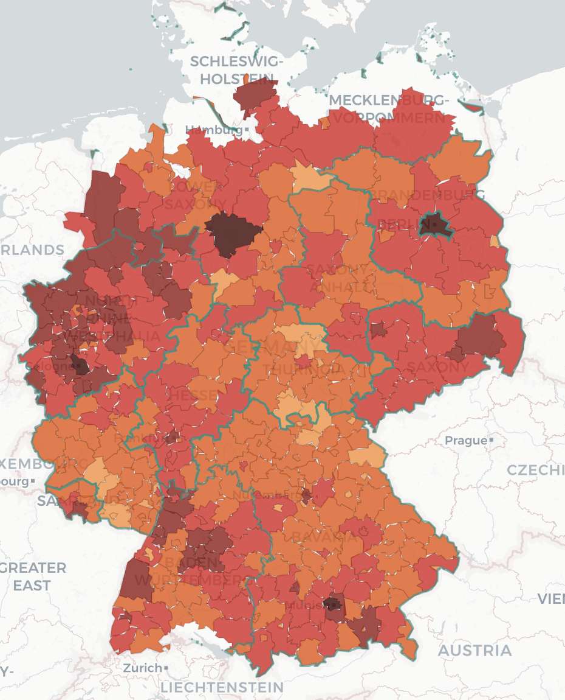

# GeoCrash DE

**Spatial analysis of German traffic accidents (2016–2024).** Four open government datasets, one PostGIS database, a FastAPI backend, and a Leaflet + deck.gl map that renders a different view of the data depending on how far you've zoomed in.

Built as the term project for TU Chemnitz's *Datenbanken und Web-Techniken* course.



---

## What it does

- Fuses accident records, administrative boundaries, population, and vehicle-registration data into one normalized, queryable schema.
- Classifies accident hotspots from raw points using Germany's official *Unfallhäufungsstelle* definition (≥5 accidents in 250m, 3 years), queryable by nearest-neighbour.
- Serves everything through a documented REST API with full provenance (source, license, snapshot date) on every response.
- Renders accidents as a choropleth, a GPU-aggregated hex-bin density layer, or individual points — switching automatically with map zoom, so the browser never tries to draw 3 million markers at once.
- Rebuilds itself from scratch with a single ETL command — nothing hand-imported.

## Tech stack

| Layer | Choice |
|---|---|
| Database | PostgreSQL 16 + PostGIS 3.4 |
| Backend | FastAPI (Python 3.11), SQLAlchemy 2 + GeoAlchemy2, hand-written parameterized SQL |
| ETL | pandas, httpx, zipfile |
| Frontend | Vanilla JS, Leaflet, deck.gl, Chart.js — no build step |
| Infra | Docker Compose (`db` + `api`) |
| Tests | pytest |

## Quick start

```bash
docker compose up -d --build                 # Postgres+PostGIS and the API
curl http://localhost:8000/healthz

python3.11 -m venv .venv && source .venv/bin/activate
pip install -e ".[dev]"

python -m etl.update                          # download, parse, and load all four sources
```

| What | Where |
|---|---|
| Map | http://localhost:8000 |
| Swagger docs | http://localhost:8000/docs |
| Health / data quality | `/healthz`, `/healthz/data-quality` |
| Postgres from host | `localhost:5433`, db `dwt`, user/pass `postgres`/`postgres` |

Run a narrower ETL pass:

```bash
python -m etl.update --dry-run
python -m etl.update --source unfallatlas --year 2024
python -m etl.update --source zones           # recompute hotspot grid after new accident years
```

Reset everything:

```bash
docker compose down -v && docker compose up -d --build && python -m etl.update
```

## API at a glance

| Router | Endpoints |
|---|---|
| `regions` | `GET /regions`, `GET /regions/{ags}`, `GET /regions/{ags}/indicators` |
| `accidents` | `GET /accidents` — filters: state, ags, year, category, participant, bbox |
| `aggregates` | `GET /aggregates/accidents`, `GET /aggregates/accident-rate`, `GET /aggregates/accident-rate/top` |
| `zones` | `GET /zones/nearest`, `GET /zones/around`, `GET /zones/nearby-hazards` |
| `metadata` | `GET /metadata/sources`, `GET /import-runs`, `GET /healthz` |

Every response carries its provenance:

```json
{
  "results": [...],
  "metadata": {
    "sources_used": ["unfallatlas"],
    "licenses": ["dl-de/by-2-0"],
    "snapshot_date": "2026-07-06",
    "import_run_ids": []
  }
}
```

## Database schema

One database, 9 tables, split by **grain** (what one row represents) rather than by source — so a single query can join accidents against population to compute a per-capita rate.

| Table | One row is |
|---|---|
| `accidents` | one crash (~3M rows) |
| `regions` | one state/district/municipality |
| `regions_history` | one retired→current AGS code mapping |
| `indicators` / `indicator_values` | one indicator definition / one (indicator, region, year) measurement |
| `accident_zones` | one classified 250m grid cell — computed, not sourced |
| `sources` / `import_runs` | dataset provenance / ETL run log |
| `lookup_codes` | coded value → label |

## Testing

```bash
pytest
```

Covers ETL idempotency, database integrity, spatial geometry correctness, and API integration.

## Documentation

- [`PLAN.md`](PLAN.md) — full design rationale, schema diagrams, decisions-and-alternatives
- [`Challenges.md`](Challenges.md) — code review history
- `docs/` — design specs and implementation plans for individual features

## License

Data is sourced under `dl-de/by-2-0` (Datenlizenz Deutschland – Namensnennung 2.0). See [`api/metadata`](http://localhost:8000/metadata/sources) for per-source attribution.
