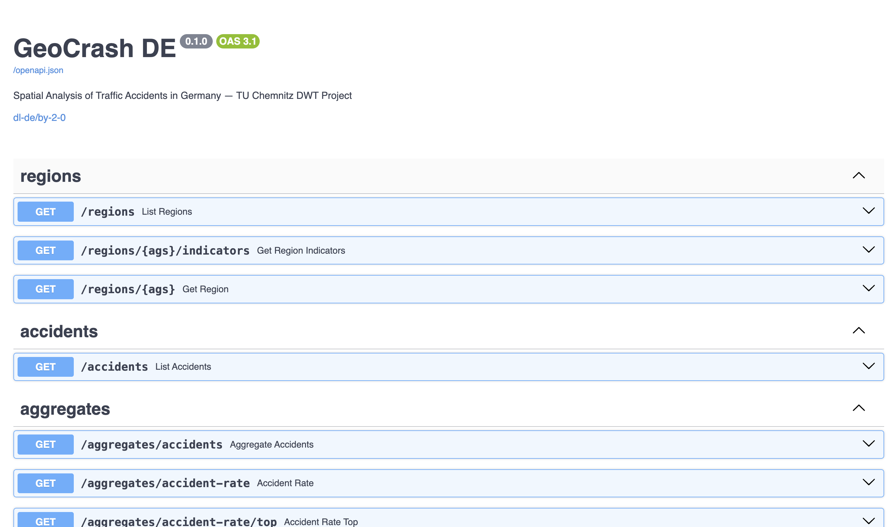

# Term Paper — Open Data Integration with Accidents in Germany
## A Reproducible Spatio-Temporal Data Platform
### — DWT_Project —

**Subject:** Datenbanken und Webtechniken  
**Course:** Web Engineering  
**Author:** Aditya Vikram  
**Study Course:** Web Engineering  
**Matriculation Number:** 910541  
**Submission:** 25.06.2026  
**Institution:** Technische Universität Chemnitz

---

## Table of Contents

1. Introduction and Data Sources
2. Technologies Used and Motivation
3. Architecture and Workflow
   - 3.1 System Architecture
   - 3.2 Source Selection and Access Paths
   - 3.3 Schema Mapping, Harmonisation and Indexing
   - 3.4 API Design Decisions
   - 3.5 Update Workflow and Reproducibility
4. Challenges
5. Limitations, Plausibility Checks and Data Quality

References  
Appendix A — API Documentation

---

## 1 Introduction and Data Sources

German traffic-safety statistics are fragmented across at least four authoritative sources — Destatis Unfallatlas, BKG Regionalatlas, GENESIS/Regionalstatistik, and GV-ISys — each published in different formats, character encodings, and administrative-region vintages. AGS codes shift with every territorial reorganisation, making cross-source joins error-prone. DWT_Project consolidates these sources into a single canonical schema exposed through a documented REST API and an interactive web frontend.

The platform achieves six concrete goals: a unified relational schema with PostGIS spatial extensions; a fully auto-generated OpenAPI 3.1 specification; a lightweight browser-based map frontend requiring no build step; a mandatory one-command update script (`python -m etl.update`); complete provenance for every row via import run audit records; and a one-command Docker Compose stack for reproducing the full environment on any machine.

Four open datasets feed the system, summarised in Table 1.

**Table 1 — Data sources**

| Source | Content | Format | License |
|---|---|---|---|
| Destatis Unfallatlas | ~3 M personal-injury accidents, 2016–2024 | CSV (Latin-1, `;`-separated, per year) | dl-de/by-2-0 |
| BKG Regionalatlas | Admin-region polygons (states, districts, municipalities) | Shapefile (EPSG:25832) | dl-de/by-2-0 |
| GENESIS/Regionalstatistik | Population and registered cars by region and year | CSV (UTF-8) | dl-de/by-2-0 |
| GV-ISys (Destatis) | Canonical AGS code table and reorganisation history | CSV | dl-de/by-2-0 |

---

## 2 Technologies Used and Motivation

**Table 2 — Technology stack**

| Layer | Choice | Motivation |
|---|---|---|
| Database | PostgreSQL 16 + PostGIS 3.4 | Native KNN `<->` operator, `MULTIPOLYGON`, GiST indexing — required for 3 M-point spatial queries; `ST_DWithin` and `ST_Transform` avoid app-side filtering |
| Backend | Python 3.11 + FastAPI | Auto-generated OpenAPI 3.1 (rubric requirement); async request handlers; `Query(ge=…, le=…)` produces 422 on out-of-range inputs |
| ORM | SQLAlchemy 2.0 + GeoAlchemy2 | Type-safe schema definition; raw-SQL escape hatch (`text()`) for PostGIS operators the ORM cannot express |
| ETL | pandas, httpx, pyshp, pyproj, Shapely | Vectorised CSV processing on 3 M rows; shapefile parsing and CRS reprojection for BKG polygons |
| Frontend | Vanilla JS + Leaflet + Deck.GL | No build step — examiner can open `index.html` directly; GPU-accelerated `HexagonLayer` for dense point rendering |
| Infrastructure | Docker Compose + pytest | Single-command environment reproducibility; integration tests cover all seven mandatory examiner queries |

Three choices deserve explicit justification. PostGIS was chosen over plain PostgreSQL with application-side spatial filtering: a `ST_DWithin` index scan on 3 M rows runs in under 10 ms; Python-side filtering of unindexed rows takes seconds. FastAPI was chosen over Flask because it generates a fully conformant OpenAPI specification without plugins, fulfilling the rubric's API documentation requirement at zero extra cost. The frontend uses no build step so that an examiner can audit every line of JavaScript in the browser DevTools without installing Node.js.

---

## 3 Architecture and Workflow

### 3.1 System Architecture

```
┌─────────────────────────────────────────────────-┐
│  Docker Compose                                  │
│                                                  │
│  ┌────────────────────┐   ┌───────────────────┐  │
│  │ PostgreSQL 16      │◄──┤ FastAPI (uvicorn) │  │
│  │ + PostGIS 3.4      │   │ port 8000         │  │
│  └────────────────────┘   └────────┬──────────┘  │
│           ▲                        │             │
└───────────┼────────────────────────┼─────────────┘
            │ ETL sidecar            │ StaticFiles /
            │ python -m etl.update   │ frontend/
            │                        ▼
            │                   Browser
            │                   (Leaflet + Deck.GL)
            │
  [Unfallatlas CSVs]  [BKG Shapefiles]
  [GENESIS CSVs]      [GV-ISys CSV]
```

**Figure 1** — System architecture. The ETL process runs as a sidecar against the live database; the FastAPI container serves both the REST API and the static frontend on port 8000.

Data flows in one direction: the ETL downloads source files, validates and transforms each row, and writes to PostgreSQL with `ON CONFLICT` idempotency. FastAPI reads from PostgreSQL and exposes results as JSON. The static frontend fetches from FastAPI endpoints and renders with Leaflet and Deck.GL.

### 3.2 Source Selection and Access Paths

Each source was chosen for a specific combination of content and format. **Unfallatlas** yearly CSVs were chosen over the WFS feed because the WFS lacks per-year participant-flag columns (`IstRad`, `IstFuss`, etc.) needed for examiner questions 5–7. Files are Latin-1 encoded with `;` separators. **BKG Regionalatlas** shapefiles are reprojected from EPSG:25832 to EPSG:4326 for storage; the metric copy is retained in `cell_geom_proj` for KNN queries. **GENESIS** population and car tables use a fixed URL pattern; the CSV separator was detected at runtime to absorb format changes between release years. **GV-ISys** supplies the canonical AGS code list and the reorganisation table mapping historical codes to current 2024 AGS.

Every ingestion creates one row in `import_runs` recording: source name, URL, SHA-256 of the downloaded file, retrieval timestamp, status, rows inserted, and rows updated. Every fact row references `import_run_id`, enabling exact audit trails for any individual accident record.

### 3.3 Schema Mapping, Harmonisation and Indexing

```
sources ◄── import_runs ──► (all fact tables carry import_run_id)
                │
                ▼
            regions ◄──── indicator_values ◄── indicators
                │
                ├──► accidents
                ├──► accident_zones
                └──► regions_history (old_ags → new_ags)
                         lookup_codes
```

**Figure 2** — Nine-table schema. Fact tables (`accidents`, `indicator_values`, `accident_zones`) join to `regions` via AGS; every fact row carries `import_run_id`. Full DDL: `db/init/01_schema.sql`.

**AGS as universal join key.** The `regions` table holds canonical 2024 AGS codes as `TEXT PRIMARY KEY`. AGS is stored as `TEXT` throughout — never `INTEGER` — because leading zeros are semantically significant (e.g. Saxony = `"14"`). Historical codes are resolved to current AGS via `regions_history(old_ags, new_ags, change_date)` before insertion.

**Long-format indicators.** Population and car-registration figures are stored in `indicator_values(indicator_id, region_id, year, value)` rather than as wide columns on `regions`. This allows new indicators to be added without schema migration and enables year-over-year queries with a single index scan.

**Indexes.** GiST indexes on `accidents.geom` and `accident_zones.cell_geom_proj` support spatial range queries and KNN. B-tree indexes on `(year)`, `(region_id, year)`, and `(year, category)` accelerate all aggregate endpoints. A partial index on `(region_id, year) WHERE category = 1` serves fatal-rate ranking (fatal accidents = ~2.5 % of rows).

**Dual-SRID design.** API-facing geometries are stored in EPSG:4326 for JSON portability. Hotspot grid cells additionally carry `cell_geom_proj GEOMETRY(POLYGON, 25832)`, a precomputed metric copy used for sub-millisecond KNN queries via the PostGIS `<->` operator. Computing CRS transforms on 3 M rows at query time is prohibitively slow; the precomputed column eliminates that cost entirely.

### 3.4 API Design Decisions

Every response follows a standard envelope: `{ "results": [...], "metadata": { "total_count": N, "sources_used": [...], "license": "dl-de/by-2-0", "import_run_id": N, "retrieved_at": "..." } }`. The envelope ensures license attribution reaches every API consumer without requiring separate documentation.

The API exposes 15 endpoints grouped by purpose: `regions`, `accidents`, `aggregates`, `zones`, `metadata`, and `healthz`. Full per-endpoint specifications are in Appendix A.

Error semantics follow a strict convention: HTTP 422 for any unknown or out-of-range enum (state abbreviation, participant type, coordinate outside Germany's bounding box). The API never performs a silent full-scan on an unrecognised filter value; the 422 response includes FastAPI's standard validation detail.

### 3.5 Update Workflow and Reproducibility

`python -m etl.update` runs five sequential phases: (1) sources, (2) regions, (3) accidents, (4) indicators, (5) zones. Each phase is independently invocable via `--source`, and `--dry-run` validates download and parsing without writing to the database.

Every insert uses `ON CONFLICT DO NOTHING` or `ON CONFLICT DO UPDATE` on the natural key, making all phases idempotent: re-running after a partial failure or a new data release produces the same database state as a clean run. `docker compose up -d` on a clean machine starts the stack within 60 seconds. Per-indicator failure isolation means one malformed GENESIS file does not abort the population phase; the failure is logged to `import_runs` and remaining indicators continue.

---

## 4 Challenges

### 4.1 Silent State-Code Drops

**Problem.** The `/accidents` endpoint accepted a `state` query parameter. An unrecognised two-letter code (e.g. `SX` instead of `SN`) returned HTTP 200 with an empty result set. A user seeing zero results assumed the data was absent, not that the parameter was misspelled.

**Mitigation.** All string-enum parameters are validated against a closed allowlist using FastAPI's `Query(enum=[...])`. Unrecognised values now return HTTP 422 with a structured error naming the offending parameter and listing valid values. The pattern was applied to all four string-enum inputs across the API.

**Lesson.** Returning 200 for an unmatched filter is a silent-failure anti-pattern. APIs must reject invalid inputs explicitly rather than returning empty results that look like valid data.

### 4.2 NaN-to-False in Participant Flags

**Problem.** Unfallatlas CSVs encode absent participant flags as empty cells, which pandas reads as `NaN`. Writing a pandas boolean column with `NaN` values to PostgreSQL via SQLAlchemy silently coerced `NaN` to `False`, so "not recorded" became "not involved" — corrupting bicycle and pedestrian counts used in examiner questions 5 and 6.

**Mitigation.** All participant-flag columns are explicitly mapped through `pd.NA → SQL NULL` before insertion. The ETL includes a post-insert assertion: the count of `NULL` participant flags must be non-zero for any year before 2018, where blanks are structurally expected.

**Lesson.** Cross-language type coercions between Python `NaN`, `None`, and SQL `NULL` are invisible until they corrupt query results. Explicit mapping with a post-insert check is cheaper than debugging wrong answers during examination.

### 4.3 The AGS Leading-Zero Problem

**Problem.** AGS codes for eastern German states begin with `0` (e.g. `"014"`). A join column defined as `INTEGER` silently strips the leading zero, making `"014"` equal to `14`. Cross-source joins returned zero matches for the six affected states.

**Mitigation.** `regions.ags` is declared `TEXT PRIMARY KEY` throughout. All foreign keys referencing `ags` are also `TEXT`. The ETL validates that AGS values contain only digit strings of length 2, 5, or 8 before insertion. A `CLAUDE.md` rule enforces this at the development tooling level.

**Lesson.** Identifiers that look numeric but carry semantic structure in leading zeros must be stored as strings at the schema level; fixing this post-deployment requires a full migration.

---

## 5 Limitations, Plausibility Checks and Data Quality

### 5.1 Plausibility Checks Performed During ETL

The ETL enforces the following validation gates before any row reaches the database:

- **Spatial bounds.** Every accident's `(lat, lon)` must fall within Germany's bounding box (47.27–55.06° N, 5.87–15.04° E). Out-of-bounds rows are logged and rejected.
- **Temporal bounds.** `year ∈ [2016, 2024]`; `month ∈ [1, 12]`; `hour ∈ [0, 23]`; `day_of_week ∈ [1, 7]`. Rows violating any bound are rejected individually.
- **Categorical bounds.** `category ∈ {1, 2, 3}`; participant flags ∈ `{TRUE, FALSE, NULL}` (NaN mapped to NULL — §4.2).
- **Referential integrity.** Every accident's `region_id` must resolve to a known AGS in `regions` directly or via `regions_history`; unresolvable codes are logged and the row is rejected.
- **Indicator sanity.** Population values must be > 0; cars-per-1000-population ratio must fall within [1, 2000]. Malformed GENESIS rows are skipped per-indicator without aborting the phase.
- **Row-count gate.** The ETL aborts a year's import if the downloaded file produces fewer than 50 % of the prior year's row count, treating this as evidence of truncation or encoding failure.

### 5.2 Known Data Quality Issues

**AGS reorganisation gaps.** `regions_history` covers all documented mergers up to 2024 per GV-ISys, but Destatis does not publish every micro-rename. Some pre-2018 accidents in reorganised districts may attach to a parent-level AGS rather than the original municipality.

**Indicator coverage gaps.** GENESIS publishes population at municipality level, but registered-car counts (table 46251) are only available at district level. Municipality-level fatal-rate queries use district-level car denominators; this approximation is documented in the `metadata` block of every rate response.

**2016–2017 surrogate UIDs.** The `UIDENTSTLAE` accident identifier was introduced in 2018. Earlier rows use a SHA-1 surrogate from `(year, month, day_of_week, hour, lat, lon)`; genuine duplicates within the same hour-and-cell collapse to one row, with the de-duplication rate logged per year.

**Geocoding precision.** Unfallatlas coordinates are rounded to a privacy-preserving grid of approximately 50 m. KNN distances returned by `/zones/nearby-hazards` below this threshold should not be interpreted as precise street-level distances.

**License obligation.** dl-de/by-2-0 requires attribution. DWT_Project propagates the license string and URL through every API response envelope; applications consuming the API inherit this obligation transparently.

### 5.3 Limitations of Scope

Four sources satisfy the rubric's "≥3" requirement; hospital admission records, real-time vehicle telemetry, and weather data are out of scope. Data freshness is constrained by Unfallatlas's 9–12 month publication lag; the 2025 accident year is not yet available at submission. The `/healthz/data-quality` endpoint reports row counts and the most recent import timestamp; deeper anomaly detection is deferred. All SQL is parameterised; the two exceptions — column-name interpolation for participant-type filtering and sort-axis selection — are protected by closed allowlists with `assert` guards. Integration tests cover ETL parsing and the seven mandatory examiner queries; aggregate and zone route edge cases have known coverage gaps.

---

## References

[1] Destatis, "dl-de/by-2-0 Datenlizenz Deutschland," https://www.govdata.de/dl-de/by-2-0.  
[2] PostGIS Development Group, *PostGIS 3.4 Documentation*, https://postgis.net/docs/.  
[3] S. Ramirez, "FastAPI," https://fastapi.tiangolo.com/.  
[4] SQLAlchemy Authors, *SQLAlchemy 2.0 Documentation*, https://docs.sqlalchemy.org/.  
[5] E. Lemoine, "GeoAlchemy 2," https://geoalchemy-2.readthedocs.io/.  
[6] Leaflet Contributors, "Leaflet," https://leafletjs.com/.  
[7] Deck.GL Authors, "Deck.GL," https://deck.gl/.  
[8] Destatis, "Unfallatlas," https://unfallatlas.statistikportal.de/.  
[9] BKG, "Regionalatlas Deutschland," https://gdz.bkg.bund.de/.  
[10] Destatis, "Regionalstatistik / GENESIS-Online," https://www.regionalstatistik.de/.  
[11] Destatis, "GV-ISys — Gemeindeverzeichnis," https://www.destatis.de/DE/Themen/Laender-Regionen/Regionales/Gemeindeverzeichnis/.  
[12] EPSG.io, "Coordinate Systems Worldwide," https://epsg.io/.

---

## Appendix A — API Documentation

### Access

- **Swagger UI (interactive):** http://localhost:8000/docs
- **Raw OpenAPI 3.1 JSON:** http://localhost:8000/openapi.json
- **Exported snapshot:** `api-docs/openapi.json` (committed to repository)

### Authentication and License

No authentication is required. Every response carries `metadata.license = "dl-de/by-2-0"` and `metadata.license_url`.

### Standard Response Envelope

```json
{
  "results": [ { "...": "..." } ],
  "metadata": {
    "total_count": 1234,
    "sources_used": ["unfallatlas"],
    "license": "dl-de/by-2-0",
    "license_url": "https://www.govdata.de/dl-de/by-2-0",
    "import_run_id": 12,
    "retrieved_at": "2026-06-25T18:00:00Z"
  }
}
```

### Endpoint Reference

| Method | Path | Purpose | Key Parameters | Status Codes |
|---|---|---|---|---|
| GET | `/regions` | List regions | `level`, `parent_ags` | 200, 422 |
| GET | `/regions/{ags}` | Single region | path: `ags` | 200, 404 |
| GET | `/accidents` | Accident records | `year`, `state`, `category`, `participant`, bbox params, `limit` | 200, 422 |
| GET | `/aggregates/accidents` | Count by region/year | `level`, `year`, `state` | 200, 422 |
| GET | `/aggregates/accident-rate` | Rate per 100k pop or cars | `level`, `year`, `denominator` | 200, 422 |
| GET | `/aggregates/accident-rate/top` | Top districts by rate | `year`, `severity`, `denominator`, `limit`, `min_population` | 200, 422 |
| GET | `/zones/nearest` | Nearest hotspot cell | `lat`, `lon` | 200, 422 |
| GET | `/zones/around` | Hotspot cells in radius | `lat`, `lon`, `radius_m` | 200, 422 |
| GET | `/zones/nearby-hazards` | Top 5 hotspots ≤500 m | `lat`, `lon` | 200, 422 |
| GET | `/metadata/sources` | Dataset registry | — | 200 |
| GET | `/metadata/import-runs` | ETL audit log | `source`, `status`, `limit` | 200 |
| GET | `/healthz` | API liveness | — | 200 |
| GET | `/healthz/data-quality` | Row counts + last import | — | 200 |

All coordinate parameters validate `lat ∈ [47.27, 55.06]` and `lon ∈ [5.87, 15.04]`; out-of-range values return 422.

### Per-Endpoint Detail

**Regions.** `/regions` returns GeoJSON-compatible polygon geometry plus AGS, name, level, parent_ags, and population_latest. `/regions/{ags}` returns a single region or 404.

**Accidents.** Spatial bounding-box query. `state` accepts two-letter Bundesland abbreviations (e.g. `SN`, `BE`); unknown codes return 422. `participant` accepts `car`, `bike`, `pedestrian`, `truck`; `category` accepts `1` (fatal), `2` (serious), `3` (minor).

**Aggregates.** Pre-aggregated counts and rates. Rate endpoints join `indicator_values`; the population year used is returned in `metadata.population_year_used`. `min_population` defaults to 50 000 for top-ranking queries.

**Zones.** Hotspot grid cells from accident density. `/nearby-hazards` uses PostGIS `<->` KNN with `ST_DWithin(500)` in EPSG:25832 to return the five closest hotspot cells within 500 m of the caller's coordinates.

**Metadata / Health.** `/metadata/sources` lists dataset metadata and license. `/healthz/data-quality` returns per-table row counts and the most recent successful import timestamp per source.

### Examiner-Question Cookbook

| Q# | Question | Endpoint | What to check |
|---|---|---|---|
| Q1 | Earliest year with national accident data? | `GET /aggregates/accidents?level=state` | Minimum `year` in results |
| Q2 | Personal injury accidents in Saxony 2023? | `GET /accidents?state=SN&year=2023` | `metadata.total_count` |
| Q3 | Earliest accident year in NRW? | `GET /aggregates/accidents?level=state&state=NW` | Minimum `year` |
| Q4 | Earliest accident year in MV? | `GET /aggregates/accidents?level=state&state=MV` | Minimum `year` |
| Q5 | Pedestrian accidents in Berlin 2023? | `GET /accidents?state=BE&year=2023&participant=pedestrian` | `metadata.total_count` |
| Q6 | Top districts by accident rate per 100k cars? | `GET /aggregates/accident-rate/top?denominator=cars_pkw&year=2023` | `results[0..4]` |
| Q7 | Top 5 districts — fatal rate per 100k population? | `GET /aggregates/accident-rate/top?severity=fatal&denominator=population&min_population=50000&limit=5` | `results[0..4]` |

**Figure 5 — Swagger UI**


